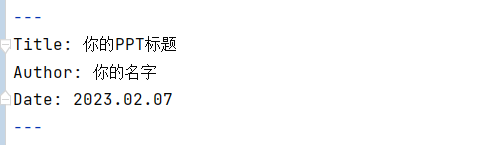

# 工具介绍

## 你还在为调整PPT的格式烦心吗？

> 这个简单的工具，将为节省很多的时间和心力

- 你只需要关注你想表达的内容
- 只需写下文字内容、想展示的图片
- 其余的，交给这个小工具吧！
- 自动化生成首页、尾页、目录
- 根据文字内容，生成具体的PPT页面
- 可以插入图片，一张PPT内不要超过两张
- 生成后，根据自己的需要可以微调
- 暂不支持动画


## 效果展示

> 本项目中readme.pptx, 就是根据本篇文字内容，生成的PPT

- 你可以在项目的目录中找到它
- 这是一个通用的模板，还有很多其他的模板

# 使用指南

## 1、下载软件包

> 下载软件包

- 你需要下载软件包
- 记得解压哦！

## 2、运行这个小工具

> 进入dict目录下，运行'ppt生成器'


## 3、选择文件和模板

> 选择合适文件、喜欢的模板

- 选择你已经写好的markdown文件
- 选择你喜欢的模板，有3个免费的模板

# 基本的格式

## 1、书写文档内容

> 可以在任何地方，书写md文件，但要记得路径


- 起任何名字，与生成的PPT标题无关
- 最好起英文的，因为你的环境有可能不支持中文
- 生成的ppt文件，在out-print中
- 可以建一个指定的文件夹，专门用于写文档
- 在本文后面，有两个写markdown文件的工具介绍

## 2、写PPT的题目

> 用两行---夹住的中间部分



- Titl'+model_name+' 后面写PPT的首页标题
- Author: 后面写你的名字，或是其他副标题
- Data: 后面可以写日期，作为尾页的日期


## 3、写PPT的目录

> 用#，加上一个空格，在后面书写的是一级标题，会自动生成目录


- 标题和标题，不要重复，否则会覆盖
- 一级标题，会自动生成PPT的目录

## 4、写每一页的标题

> 用##，加上一个空格，在后面书写的是二级标题，会自动生成为每一页的标题


- 在每个一级标题下，一定要有二级标题
- 有多少个二级标题，就会生成多少页的PPT
- 二级标题之间，不要重复，否则会覆盖

## 5、写每一页的内容

> 每页内容，可以有几种组成的部分


- ‘>’+空格：一行文字介绍，呈现在页标题的下方
- 图片``
- 图片地址要写绝对路径
- 一张图片会居中，两张图片会平分
- 列表用'-’+空格，后面书写该陈列点的内容
- 可以一张图片+一部分陈列点的方式

## 6、随时记录你的灵感

> 如果你有内容，不想展示在PPT上

- 书写两行```
- 在两行中间，记录你的灵感
- 这中间的内容，将不会展现在PPT上

# 踩坑答疑

## 一些报错点 

> 如果你遇到了问题，可以先来这里看看

- 如果要重新生成，一定要关闭原来的生成的文件
- 图片可能会出现缩略不一致的情况，可以手动调整一下
- 更多的问题，可以在公众号内询问


## 交流群

> 本来是不想创建交流群的，但想到大家可能会遇到使用上的问题，所以就建一个答疑群吧

- 免费用户：后台回复"小助手"获得小助手的微信，添加小助手后说明来意，然后小助手会拉您进群
- 付费用户：付费后，会连同代码、模板，一起将群二维码发给您


# 付费定制化

## 获取更多的模板

> 在微信公众号内回复"PPT模板"，即可获得更多的模板


- 现在已有十多个模板，满足基本通用场景的使用
- 定价￥10
- 关注微信公众号"司镜233", 回复”PPT模板“
- 付费后，会给您发送特定的PPT模板和模板代码
- 使用方式和普通的一样，但是模板会更多
- 具体的模板样式，可以参见后面的主题展示


## 模板定制化

> 可以根据你自己的喜好和要求，定制化一套模板和相应的代码

- 如果你想定制一套自己的代码和模板，可以联系我们进行个性化的定做
- 定制带有特定个的logo、风格的模板，作为长期使用
- 付费标价￥200/次，如果要求比较复杂看情况而定
- 关注微信公众号"司镜233", 说出你想要的风格和样式吧！


# 主题展示


## 通用

> 这是通用风格的样式展现


## 通用-红白

> 这是一个通用的风格，采用红色和白色进行搭配


## 通用-蓝白

> 这是一个蓝白风格的展现


## 通用-蓝黄

> 这是一个通用风格的展现，采用蓝色和黄色进行搭配


## 水彩

> 这是水彩风格的样式展现


## 科技

> 这是科技风格的样式展现


## 书法

> 这是一个书法风格的样式展示


## 教学-绿色黑板

> 这是教学通用的风格展示，采用绿色的黑白作为底色


## 教学-黑色黑板


> 这是教学通用的风格展示，采用黑色的黑板为底色


## 读书

> 这是一份读书风格的展示，搭配绿植，更显清新


## 灰红

> 这是灰色和红色搭配的风格


## 简约

> 这是一个简约风格的展示


## 极简

> 这是一份极简风格的展示


## 可爱

> 这是一份可爱风格的内容展示


# 附1：使用VS写markdown

## 1、创建一个文件夹

> 新建一个文件夹，放置你的PPT文字内容


- 在文件夹内，再创建一个文件夹
- 命名为images，用来存放你的图片

## 2、新建一个文件

> 可以使用任何markdown的软件写你的文字，这里使用免费的vs


- 点击New File，新建一个文件
- 文件名，一定要以.md结尾

## 3、打开预览

> 如图所示，打开预览


## 3、开始书写你的灵感吧！

> 按照上述的格式，书写你的灵感吧！

# 附2：使用Typora书写

## 图片路径设置

> 我比较喜欢用Typora，但它是付费的


- Typora可以设置图片粘贴路径
- 不需要手动书写图片路径
- 直接复制、粘贴即可
- 在文件-偏好设置里，按照我这样设置
- 记得，不要选择相对路径
- 这样我们也不用手动管理文件中的图片了

